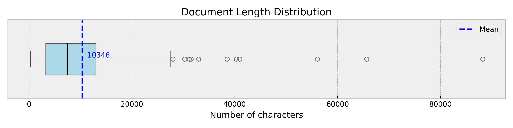

# Stop Searching, Start Asking: LangGraph Docs at Your Fingertips 🤖🚀

Retrieval-Augmented Generation (RAG) is becoming a popular alternative to fine-tuning large language models (LLMs). Instead of retraining the entire model whenever new data comes in—a process that can be expensive and slow—RAG lets you keep your models up-to-date by simply updating the data they retrieve from. Its main advantages are:

* **Cost-effective**: No need to retrain the LLM. Instead, it retrieves the most relevant information from an external knowledge base.
* **Easily updatable**: If the knowledge changes, you just update the data store—no need to touch the model.
* **Flexible and scalable**: You can tailor the knowledge base per user, per domain, or per task without duplicating model infrastructure.
* **Transparent**: You always know where the information came from, enabling better debugging and control.
* **Grounded in reality**: By combining LLM reasoning with real data, RAG systems are more factual and reliable.

These advantages make RAG a perfect fit for building intelligent systems that need to stay current and operate over specific corpora—like documentation, internal knowledge, or dynamic content. In this MVP, we present a custom RAG pipeline that uses the **LangGraph documentation** as the core knowledge base and builds the entire reasoning and retrieval workflow using **LangGraph** itself.

## here we should add the RAG pipeline diagram as an image

---

## Toolset 🛠️

Our MVP leverages a modular RAG system where each component has a clear role:

* **LangGraph** is used not just as the subject of the knowledge base, but also as the **framework for defining the workflow** of the assistant.

* **LangChain** provides the foundation for LLM calls and tool integration.
* **Qdrant** is used as the **vector database** to store and retrieve documentation chunks.
* **LangSmith** monitors, traces, and evaluates every step of the reasoning and retrieval process.

* The LLM provider is **OpenAI**, configured for a deterministic behavior (temperature = 0.1) to avoid random variations in the model’s output during execution.

* For the implementation of the RAG system, we built three components:
  * **Prompts**: A entry package that contains all the prompts used to generate the responses of the LLM. The prompts are stored in a YAML file and can be easily modified as needed following the guidelines provided in the [Ready Tensor](https://app.readytensor.ai/publications/building-prompts-for-agentic-ai-systems-aaidc-week2-lecture-1-36Hu3DC3TLdu).

  * **Vector Store**: A component in charge of ingesting the LangGraph documentation and storing it in a vector database using Qdrant.

  * **RAG-pipeline**: A component in charge of creating a custom RAG pipeline.

This stack allows us to construct a **chatbot** that can deeply understand and navigate LangGraph documentation, answer highly technical questions, and even explain multi-agent workflows by leveraging the source content directly. As result, you don't need to be an expert in LangGraph to use it.

---

## Architecture Overview 🏗️

Let's break down the architecture of the system going through each detail and decision made.

### **Prompt Component**

We have built a Python class to handle prompts in a centralized and modular way. The class takes into account the key elements that a prompt should include: [**role, goal, instruction, context, output_constraints, output_format, examples**]. It also supports the three main reasoning strategies: chain-of-thought, ReAct, and self-ask. Additionally, it allows prompts to receive input variables that can be dynamically replaced while maintaining compatibility with LangChain’s [PromptTemplate](https://python.langchain.com/api_reference/core/prompts/langchain_core.prompts.prompt.PromptTemplate.html) abstraction. As a result, creating a new prompt is as simple as writing a YAML file with the desired structure and using the class of this component to load it, either as a string or directly as a LangChain PromptTemplate object.

For our chatbot, we created two prompts:

1. A System Prompt that acts as a gatekeeper to control access to the LangGraph knowledge base. Its purpose is to filter user questions and determine whether they fall within the chatbot’s scope — in this case, answering questions about LangGraph. If the question is out of scope, the chatbot politely informs the user that it cannot assist with that request.

2. The Chatbot Prompt, which acts as an agent responsible for deciding how to respond to user questions. It has access to the retriever tool, allowing it to search the knowledge base and retrieve relevant information to answer the user’s query. This prompt follows the ReAct reasoning strategy to ensure that responses are coherent and aligned with LangGraph’s knowledge. The model is guided to reason step-by-step based on the information currently available, determining whether more information needs to be retrieved or if an answer can be generated with the existing data. Furthermore, this system prompt encourages the model to generate smaller, more precise sub-questions to retrieve the most relevant information.

### **Vector Store Component**

Complete this section.....

This component is in charge of an important step of any RAG system: ingesting and indexing the data into the vector store.

1. Describe the feature of the data used(the files of the LangGraph documentation) and how we chunk it and the content of each chunk including the max chunk size in the recursive splitting process used.

for showing the data structure in the documents:

```bash
Total number of documents: 184
Minimum of document length: 264
Average of document length: 10370
Maximum of document length: 88210
Q1 (25th percentile): 3306
Values below Q1: 46
Q2 (50th percentile): 7471
Values below Q2: 92
Q3 (75th percentile): 13031
Values below Q3: 138
```



2. Why we use Qdrant as the vector store and explain a bit the process of index the documents using the embedding model used, in this case openai's `text-embedding-3-large`.

### **RAG-pipeline Component**

here you can complete some general information but @manuel is going to complete the details of the RAG-pipeline.

#### **RAG-pipeline** explain the workflow implemented using LangGraph

....

#### Use the vector store as a tool to retrieve information requested by the model as a tool call

....

#### The state of the workflow in each turn

.....

#### **Memory**

The system can store interactions in memory (PostgreSQL checkpoints) using **LangGraph's native support**, allowing the conversation to continue with context across multiple turns. Trimmer the memory to a maximum of 5 chat interactions....

---

## Monitoring and Evaluation with LangSmith 🧪

Every node in the graph is tracked and evaluated using **LangSmith**. It is a powerful tool for monitoring and evaluating the performance of the LLM system and its integration is immediate as LangSmith is a part of the LangChain ecosystem. This includes:

* LLM inputs/outputs
* Retrieved document chunks
* Decomposition and tool usage traces
* Error tracking and latency metrics

LangSmith enables **automated evaluations**, **version comparisons**, and **debugging**, ensuring the RAG system is continually improving.

---

## Final Product and how to use it

Describe the final product and how to use it in the notebook as an interactive chat using the goodness of Jupyter notebooks.

---

## 🚀 Example Interactions

Show pictures of the example interactions.

Important: add the following use cases:

1. when the user ask for generic questions explain how the system respond.

2. Example for a complex question for example: the diference of a workflow and an agent and show how the system break down the question and generate two tools calls to retrieve information from the vector store, one for to know the definition of a workflow and another for to know the definition of an agent and finally generate a response using the retrieved information.

Some example queries the assistant can handle:

> “What is the difference between a supervisor and a router in LangGraph?”

> “Explain how multi-agent workflows are modeled in LangGraph.”

> “How do I checkpoint memory in LangGraph between steps?”

Each query triggers a chain of reasoning, retrieval, synthesis, and summarization—powered by agents that understand both the question and the structure of the documentation.

---

## 📉 Observations and Limitations

### 💡 Strengths

* Handles deep, multi-hop technical questions with structured reasoning.
* Modular architecture supports scaling to other domains beyond LangGraph docs.
* Open-source tooling ensures transparency and extensibility.

### ⚠️ Limitations

* **Latency** can increase due to decomposition and re-retrieval cycles.
* **Reliance on vector search**: if chunking isn’t optimal, relevant info might be missed.
* **No fine-tuned ranking model yet**—retrieval is purely based on embeddings.

---

## Concluding Remarks 🧩

....

---

## 🛠️ Future Enhancements

* Incorporate **document summarization** before indexing to improve retrieval relevance.
* Add **document-based reranking** with LLM or cross-encoder.
*
*

---

## 📬 Contact & Contribution

This project is open for contributions, feedback, and collaboration.

* 📧 **Email**: \[[tu\_email@ejemplo.com](mailto:tu_email@ejemplo.com)]
* 🐙 **GitHub**: [tu\_usuario](https://github.com/tu_usuario)

Feel free to reach out or fork the project!
