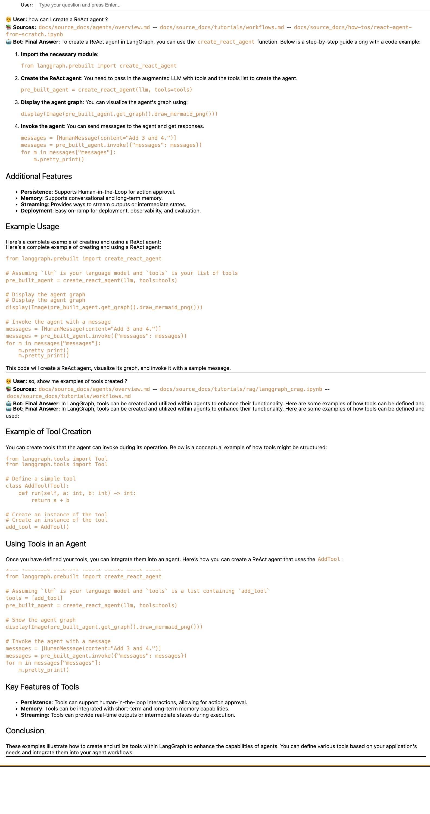

# Stop Searching, Start Asking: LangGraph Documentation at Your Fingertips 🤖🚀

Retrieval-Augmented Generation (RAG) is becoming a popular alternative to fine-tuning large language models (LLMs). Instead of retraining the entire model whenever new data comes in—a process that can be expensive and slow, RAG lets you keep your models up-to-date by simply updating the data source they rely on. Its main advantages are:

* **Cost-effective**: No need to retrain the LLM. Instead, it retrieves the most relevant information from an external knowledge base.
* **Easily updatable**: If the knowledge changes, you just update the data store—no need to touch the model.
* **Flexible and scalable**: You can tailor the knowledge base per user, per domain, or per task without duplicating model infrastructure.
* **Transparent**: You always know where the information came from, enabling better debugging and control.
* **Grounded in reality**: By combining LLM reasoning with real data, RAG systems are more factual and reliable.

These advantages make RAG a perfect fit for building intelligent systems that need to stay current and operate over specific corpora—like documentation, internal knowledge, or dynamic content. In this MVP, we present a custom RAG pipeline that uses the **LangGraph documentation** as the core knowledge base and builds the entire reasoning and retrieval workflow using **LangGraph** itself.


---

## Toolset 🛠️

Our MVP leverages a modular RAG system where each component has a clear role:

* **[LangGraph](https://www.langchain.com/langgraph)** is used not just as the subject of the knowledge base, but also as the **framework for defining the workflow** of the assistant.

* **[LangChain](https://www.langchain.com/langchain)** provides the foundation for LLM calls and tool integration.

* **[Qdrant](https://qdrant.tech/)** is used as the **vector database** to store the embeddings generated from the chunked documents and retrieve them when needed.

* **[LangSmith](https://smith.langchain.com/)** monitors, traces, and evaluates every step of the reasoning and retrieval process.

* The LLM provider is **[OpenAI](https://openai.com/)**, configured for a deterministic behavior (temperature = 0.1) to avoid random variations in the model’s output during execution, making it suitable for technical documentation answering.

* For the implementation of the RAG system, we built three components:
  * **Prompts**: An entry package that contains all the prompts used to generate the responses of the LLM. The prompts are stored in a YAML file and can be easily modified as needed, following the guidelines provided in the [Ready Tensor](https://app.readytensor.ai/publications/building-prompts-for-agentic-ai-systems-aaidc-week2-lecture-1-36Hu3DC3TLdu).

  * **Vector Store**: A component in charge of ingesting the LangGraph documentation and storing it in a vector database using Qdrant.

  * **RAG-pipeline**: A component in charge of creating a custom RAG pipeline.

This stack allows us to construct a **chatbot** that can deeply understand and navigate LangGraph documentation, answer highly technical questions, and even explain multi-agent workflows by leveraging the source content directly. As result, you don't need to be an expert in LangGraph to use it.

---

## Architecture Overview 🏗️

Let's break down the architecture of the system going through each detail and decision made.

### **Prompt Component** 🔗

We have built a Python class to handle prompts in a centralized and modular way. The class takes into account the key elements that a prompt should include: [**role, goal, instruction, context, output_constraints, output_format, examples**]. It also supports the three main reasoning strategies: chain-of-thought, ReAct, and self-ask. Additionally, it allows prompts to receive input variables that can be dynamically replaced while maintaining compatibility with LangChain’s [PromptTemplate](https://python.langchain.com/api_reference/core/prompts/langchain_core.prompts.prompt.PromptTemplate.html) abstraction. As a result, creating a new prompt is as simple as writing a YAML file with the desired structure and using the class of this component to load it, either as a string or directly as a LangChain PromptTemplate object.

For our chatbot, we created two prompts:

1. A System Prompt that acts as a gatekeeper to control access to the LangGraph knowledge base. Its purpose is to filter user questions and determine whether they fall within the chatbot’s scope — in this case, answering questions about LangGraph. If the question is out of scope, the chatbot politely informs the user that it cannot assist with that request.

2. The Chatbot Prompt, which acts as an agent responsible for deciding how to respond to user questions. It has access to the retriever tool, allowing it to search the knowledge base and retrieve relevant information to answer the user’s query. This prompt follows the ReAct reasoning strategy to ensure that responses are coherent and aligned with LangGraph’s knowledge. The model is guided to reason step-by-step based on the information currently available, determining whether more information needs to be retrieved or if an answer can be generated with the existing data. Furthermore, this system prompt encourages the model to generate smaller, more precise sub-questions to retrieve the most relevant information.

### **Vector Store Component** 🔗

For the vector store component, we propose an efficient approach for handling processes including documentation fetching, optimized chunking of the loaded documents, embedding generation and storing in the vector database. This component is in charge of an important step of any RAG system: ingesting and indexing the data into the vector store. The involved functionalities and their significance are described as follows:

#### **Documentation loading**

We have defined functions to load the documentation from the official [LangGraph documentation](https://github.com/langchain-ai/langgraph) by cloning the repository and filtering the relevant technical documents during the loading process. In addition, the loaded document *ipynb* files are converted to markdown string using only the markdown and code cells without output cells for optimized and use case specific retrieval. Once downloaded, the documents are stored in a target path for quick loading without the need to clone the repository, thereby enabling the user to choose downloading only if needed.

#### Data analysis

The downloaded data includes 184 documents. A detailed statistical analysis of the document lengths (in number of characters) served as the foundation for designing an efficient chunking strategy, aligned with both the corpus characteristics and the downstream requirements for processing, indexing, and retrieval.


The key statistics of the original dataset are summarized as follows:

```bash
Total number of documents: 184
Minimum of document length: 264
Average of document length: 10370
Maximum of document length: 88210
Q1 (25th percentile): 3306
Values below Q1: 46
Q2 (50th percentile): 7471
Values below Q2: 92
Q3 (75th percentile): 13031
Values below Q3: 138
```

As illustrated in the previous figure, the distribution shows a mean document length of approximately 10,370 characters and a median (Q2) of 7,471 characters, indicating that most documents fall below 10,000 characters. The first quartile (Q1) is positioned at 3,306 characters, while the third quartile (Q3) reaches 13,031 characters. Despite this concentration around mid-sized documents, the dataset contains a few significant outliers: several documents exceed 40,000 characters, with the largest reaching 88,210 characters.

This statistical overview informed the following design decisions:

* Chunk size: A chunk size of 5,000 characters was selected, representing approximately half of the average document length. This offers a balanced partitioning strategy for both shorter and longer documents.

* LLM optimization: A chunk size of 5,000 characters roughly corresponds to ~1,000 tokens after processing. Considering that models like *gpt-4o-mini* support a context window of 128K tokens, this chunk size offers enough context for each retrieved chunk while keeping the total token usage well within the model’s capacity. This balance ensures effective grounding for generation while maintaining cost-efficient inference.

* Handling long documents and overlap configuration: Larger documents are segmented into multiple uniform chunks with an overlap of 800 characters between consecutive fragments. This approach reduces variability in chunk lengths, maintains consistency across the dataset, and preserves contextual continuity between chunks, thereby enhancing semantic search and retrieval performance.

* Flexibility: Both the chunk size and the chunk overlap are fully configurable parameters, allowing adjustments based on system objectives, model capabilities, or operational constraints. These values can be easily modified through the YAML configuration files before the document ingestion.

With the above considerations in place, the splitting process was implemented using LangChain’s RecursiveTextSplitter, which prioritizes natural breakpoints such as code cells, paragraphs and sentences to improve the internal coherence of the generated chunks. As a result, the original set of 184 documents was transformed into 581 chunks, forming the dataset used for the indexing phase.

#### Indexing chunks into the vector database

Qdrant vector store is then used to generate the embeddings from the processed documentation chunks and store them in the vector database. For the embedding generation, we have used OpenAI’s *text-embedding-3-large* model accessed via the native OpenAI integration with LangChain. This choice was driven by the ease of integration, the strong support provided by the LangChain ecosystem, and the high-quality semantic representations produced by this embedding model.

We selected Qdrant as the vector store due to its excellent scalability and flexibility. Qdrant can be easily deployed in multiple environments: locally for development and testing, inside Docker containers for isolated and reproducible deployments, or fully managed in the cloud for production-scale systems. This makes it well-suited for both small-scale prototypes and large-scale RAG applications.

During the indexing process we have stored the source path of each document in the metadata, in addition to embedding the document content. This allows the system to provide users with full transparency about where each retrieved piece of information originated, enabling easy reference back to the original documentation when needed.

### **RAG-pipeline Component** 🔗

RAG pipeline stands at the core of facilitating the workflow of the entire chatbot session concerning the technical documentation. It utilizes tool logic to efficiently enable the query receiving, embedding transformation, semantic matching in the vector database, and finally retrieving the response in natural language while keeping the context of the conversation for enriched fetching.


#### **RAG-pipeline** as custom workflow

We have implemented a custom RAG pipeline using LangGraph to define the assistant’s workflow. Its graph-based approach enables the design of flexible and scalable pipelines that can be easily adapted to project requirements, while fully leveraging LangGraph’s extensive ecosystem and integration capabilities. Built as an extension of LangChain, LangGraph is specifically designed to support robust and stateful multi-actor applications with LLMs by modeling the workflow as a graph of nodes and edges.

1. The RAG system we have built begins with a **Scope Guard** that filters user questions to determine whether they fall within the chatbot’s scope, which in this case is answering questions related to LangGraph. Since our knowledge base is fully populated with LangGraph documentation, it would not make sense for the chatbot to handle queries outside this domain. If a question falls outside the defined scope, the chatbot politely informs the user that it cannot assist with the request. For this task, the system prompt provides the model with context about what LangGraph is and its purpose, allowing it to recognize relevant questions even if the term “LangGraph” is not explicitly mentioned.

2. In the second stage, if the model determines that the question is related to LangGraph, a ReAct-based agent takes over. This agent has access to a retriever tool that searches the knowledge base to retrieve the most relevant information and generate a coherent response aligned with LangGraph’s documentation. At each step, the model analyzes the information it has retrieved and decides whether additional information is needed or if it can answer the question based on the current data. If further information is required, the model generates sub-questions to query the vector database. It is important to note that the model can generate one or more sub-queries and, after receiving results from the vector store, may decide to continue querying if the information remains insufficient. This iterative cycle is managed through an **observer pattern** that tracks the number of retrievals made for a given user query. Once a predefined limit is reached, the model is forced to generate a final response based on the information collected up to that point.

#### Vector store as retrieval tool

We leverage LangChain’s native integration with Qdrant to create a vector store that enables efficient retrieval of information from the knowledge base, allowing the model to generate coherent responses aligned with LangGraph’s documentation. One of the key advantages is the simplicity of exposing the vector store as a retrieval tool: it only requires using the *similarity_search* function, which automatically converts the user’s query into embeddings and retrieves the most relevant chunks from the vector database.

The retrieval tool is designed to provide source references for each response, allowing users to easily identify which sections of the documentation were consulted to generate the answer. This not only enables users to quickly access the original content for further details if needed, but also increases trust by offering full transparency into the information sources.

An additional design choice is the limit on the number of retrieved chunks, which we have set to 3 per user query. This decision is driven by the decomposition strategy established in the prompt, where the model breaks down complex queries into multiple sub-queries. Empirical testing has shown that this number of retrieved chunks provides the model with sufficient grounded information to generate accurate and focused responses, while still encouraging iterative refinement when necessary.

#### The State of the workflow and the **Memory**

Each user query is stored in the graph’s global state, which includes the message history, the list of references used to generate the response, and the number of retrieval queries the model has performed for that specific question. The latter two are reset every time the user submits a new question. Additionally, after generating a response, any messages related to tool calls are removed from the state to keep it clean.

To control how much message history the model has access to, we apply a sliding window approach to trim older messages. In our implementation, the model only retains access to the last 5 user interactions, meaning the last 5 questions along with their corresponding answers. This is a simple yet widely adopted strategy in the community due to its ease of implementation and efficiency.

For global state management, we leverage LangGraph’s native support for checkpoints, which allows for different levels of persistence: from basic checkpoints that store message history in local memory, to more advanced solutions that enable persistent storage. We recommend the latter and provide an example of how to implement it using [PostgreSQL checkpoints](https://github.com/MAQuesada/langgraph_documentation_RAG/blob/main/test_notebooks/rag_example.ipynb).

---

## Monitoring and Evaluation with LangSmith 📊

Every node in the graph is tracked and evaluated using **LangSmith**. It is a powerful tool for monitoring and evaluating the performance of the LLM system and its integration is immediate as LangSmith is a part of the LangChain ecosystem. This includes:

* LLM inputs/outputs
* Retrieved document chunks
* Decomposition and tool usage traces
* Error tracking and latency metrics

LangSmith enables **automated evaluations**, **version comparisons**, and **debugging**, ensuring the RAG system is continually improving.

---

## Final Product and How to Use It 🎯

You can use our LangGraph-powered assistant directly through a Jupyter Notebook interface. We provide an interactive notebook named `test_end_to_end.ipynb` that allows you to interact with the assistant just like with any chatbot you're familiar with.

The following instructions explain how to set up the environment and start using the assistant:

**1. Clone the Repository**

```bash
git clone https://github.com/MAQuesada/langgraph_documentation_RAG
cd langgraph_documentation_RAG
```

**2. Install Dependencies with Poetry** : If Poetry is not installed on your system, you can install it with:

```bash
curl -sSL https://install.python-poetry.org | python3 -
```

Once Poetry is installed, run the following commands to install project dependencies and activate the virtual environment:

```bash
poetry install
poetry self add poetry-plugin-shell # only if you haven't installed it before
poetry shell
```

**3. Set Up Environment Variables:** Create your .env file by referring to the example.env file:

You are ready to run the `test_end_to_end.ipynb` notebook. It will include:

* Clone the official LangGraph documentation repository.
* Load and split the documentation into optimized chunks.
* Generate embeddings using OpenAI’s text-embedding-3-large model.
* Store the embedded chunks into Qdrant for later retrieval.
* Build the RAG-pipeline instance.
* Create an interactive cell for chat.

---

## Example Interactions 💬

In this section, we present several screenshots illustrating different use cases of the assistant.
Note that when the sources section appears in the answer, it indicates that the assistant has performed a call to the retrieval tool. These examples provide a high-level overview of how the assistant behaves across various types of queries.

**Case 1:** When the user asks general questions, the assistant responds with a polite answer.


**Case 2:** In this example, the user asks a question that requires the assistant to perform multiple queries on different topics to retrieve relevant information and provide a concise answer regarding the differences between a workflow and an agent according to LangGraph. In the second screenshot, we can see a snippet from the LangSmith trace showing how, upon receiving the user’s question, the ReAct agent decided to make three tool calls to gather the necessary information.


**Case 3:** An example of a complex question that includes code snippets, which the assistant is able to handle successfully.



---

## Observations and Limitations 📉

### Strengths

* Can handle multiple users keeping their own state and conversation history.
* Modular architecture supports scaling to other domains beyond LangGraph docs.
* Open-source tooling ensures transparency and extensibility.

### Limitations

* **Reliance on vector search**: if chunking isn’t optimal, relevant info might be missed.
* **No ranking model**: retrieval ranking is purely based on embedding similarity.

* **Lack of automated evaluation system**: currently, there is no integrated automated evaluation pipeline to continuously assess and improve the system's performance.

### Concluding Remarks

This project demonstrates the capabilities of LangGraph as both a framework for workflow orchestration and a domain-specific knowledge source for building specialized RAG agents. The assistant delivers reliable, traceable, and explainable responses grounded in technical documentation, enabling the creation of customizable and scalable support agents across diverse domains. Continued advancements in retrieval strategies, ranking mechanisms, and automated evaluation will further strengthen the system’s accuracy, resilience, and adaptability.

### Future Enhancements

* Incorporate **document summarization** before indexing to improve retrieval relevance.
* Add **document-based reranking** with LLM or cross-encoder.
* Add a more advanced chunking strategy to improve retrieval relevance, for example, using a [semantic chunking strategy](https://python.langchain.com/docs/how_to/semantic-chunker/).

---

## Contact & Contribution 📬

This project is open for contributions, feedback, and collaboration.

* 🐙 **GitHub**: [langgraph_documentation_RAG](https://github.com/MAQuesada/langgraph_documentation_RAG/)
* 📧 **Email**:[ [malejandroquesada@gmail.com](mailto:malejandroquesada@gmail.com), [tiwari.pranav1999@gmail.com](mailto:tiwari.pranav1999@gmail.com), [utkarsh251096@gmail.com](mailto:utkarsh251096@gmail.com)]

Feel free to reach out or fork the project!
